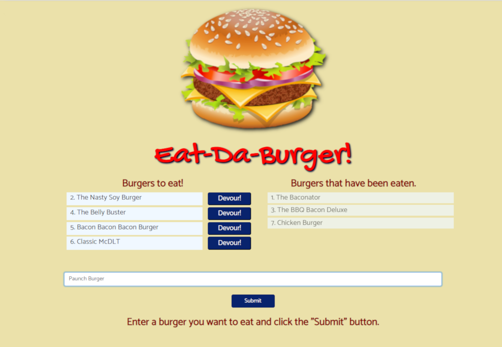
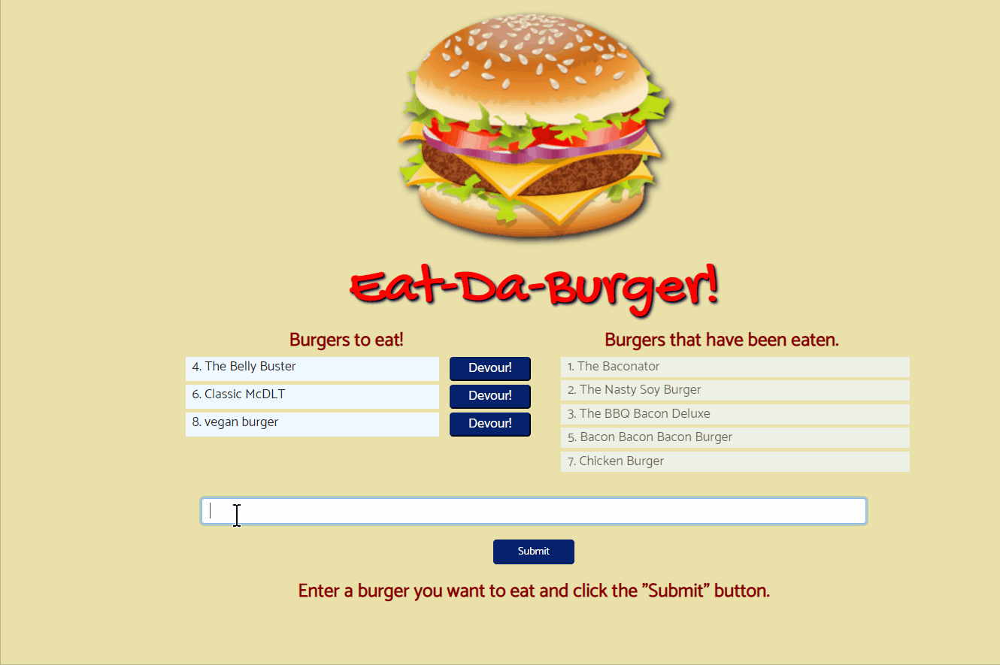

# Eat Da Burger

## [Eat Da Burger deployed app](https://powerful-crag-42305.herokuapp.com/)

---

## About Eat Da Burger

The user inputs the burger(s) they would like to eat to the `Eat Da Burger` app. The app does a `POST` of user input to a MySQL database and updates the screen to reflect any additions. There are also `schema.sql` & `seeds.sql` files to set up the database and add the initial values.

Each item has a button that allows the user to chose a burger to 'devour'. Clicking that button triggers a `PUT`, which updates the values in the database to reflect that the burger has been eaten, and the screen is updated to reflect this change.

---

## Description of the problem:

`Eat Da Burger` needed a way to store user-entered data with persistence, display that data onscreen, and update the onscreen display when the user adds an additional item or changes its state.

## Technical Solutions:

- A MySQL database was used to store user data. The database was managed locally for testing using MAMP and MySQL Workbench.
- Heroku was used to host the database remotely for production.
- Burgers are given a state of undevoured when created, and are rendered into the `Burgers to eat!` column. Once the user clicks the devour button, the state is changed to devoured, the database is updated, and it is rendered to the `Burgers that have been eaten` column.

---

## Technical details:

- jQuery is used to collect user input and pass it to the database, as well as reload the page, via AJAX calls.
- Handlebars is used to create the HTML views. The `main.handlebars` file contains the HTML including links to the stylesheets and jQuery library, as well as the handlebars `{{{body}}}` tag. The `index.handlebars` file contains the HTML body to display the complete webpage, including the buttons to change the burger state, the form for user input, and the handlebars tags for the database records.

## How the App is Organized:
- This app uses the `Model-View-Controller (MVC)` Architecture.
  - The `Model` contains the data that is created or updated. This data exists in a MySQL database, and is supplied in the form of `schema.sql` & `seeds.sql` files. A JavaScript file containing jQuery interacts with this data.
  - The `Views` component is all of the front-end code in the form of 2 Handlebars files which display the contents of the database onscreen.
  - The `Controller` component is the intermediary between the `Model` (database) and `Views` (HTML front end).

## How to Run the App Locally:

#### Setup - MySQL/MAMP

1. You will need to have a MySQL server running to use this app locally. MAMP is free software that runs a MySQL server on your local machine. Their URL can be found in the `Technologies Used` section below. Once you have a MySQL server running, take note of the `host`, `port`, `user` and `password` info on the server. On MAMP, this can be accessed clicking on the `open start page` icon on the MAMP app.

2. Install and configure the MySQL database app. For `MySQL Workbench`, on the start screen, click on the add or edit icons next to `MySQL Connections` and check that the settings correspond to the MAMP settings. The password is normally `root`. Once the settings are entered, click the `Test Connection` button to confirm that the connection is working.

#### Setup - Database:

1. Open the code for `schema.sql` (found in the `db` folder) in your text editor, copy it, and paste it into the Query window of `MySQL Workbench`.

2. Click the leftmost lightning-bolt icon (to the right of the disk icon), or select Query - Execute (All or Selection) in the Workbench menu. This will create the schema (skeleton) for the database.

3. Then click on the refresh icon at the top right side of the `SCHEMAS` panel to confirm that the database was created. It should be called burgers_db. Click on the dropdown arrows of the database and confirm that the database was created, and that it has a table named `burgers` with 3 of columns.

4. Delete the existing code and paste in the contents of the `seeds.sql` file. This will import the data into the database. Click the left-most lighting bolt and click the refresh. expand the tables, and select the product table. Three small black icons will appear to the right. Click the right-most one, which looks like a small spreadsheet with a lightning bolt in the corner. This will display a preview of the database structure. Confirm that the table was created. You can also check the Output window on the bottom for any error messages.

#### Setup - Node, Express, MySQL, and the server.js file

1. If not installed already, download & install `Node.js` on your computer.

2. Copy all the supplied the files to the directory you wish to run `Eat Da Burger` from.

3. At the command line, navigate to the directory where the server.js file is located and type `npm i` - this will read the `package.json` file and install any needed packages. They will be installed into a node_modules folder.

4. Open `connection.js` in a text editor and change the connection info as needed to match the settings in your MySQL server and save it. In `server.js` take note of the port number at the top. If you are on a Mac, the port number in `connection.js` should be 8889; on a Windows machine, it should be 3306.

#### How to use Eat Da Burger locally:

1. Navigate in the command line to the directory where the server.js file located. Type `node server` at the prompt. This will run the server portion of the app.

2. Open a new web browser window. Type `localhost:3000/index` to run the client portion of the app.

---

## Demo:

## 

## Built with:

- [Express npm package](https://www.npmjs.com/package/express)
- [Google Fonts](https://fonts.google.com/)
- [Handlebars templating engine](https://handlebarsjs.com/)
- [Heroku](https://heroku.com)
- JavaScript
- [jQuery](http://jquery.com/)
- [MySQL Workbench](https://www.mysql.com/products/workbench/)
- [MAMP local server](https://www.mamp.info/en/)
- [Node.js](https://nodejs.org)
- [Twitter Bootstrap CSS framework](http://getbootstrap.com/)

## Authors:

`Eat Da Burger` was coded by me, and is maintained by me.
